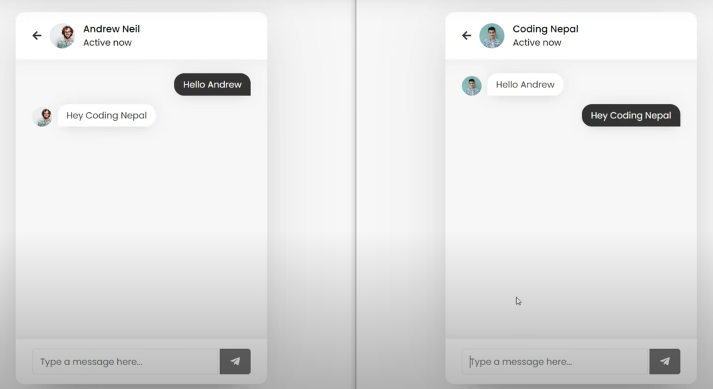
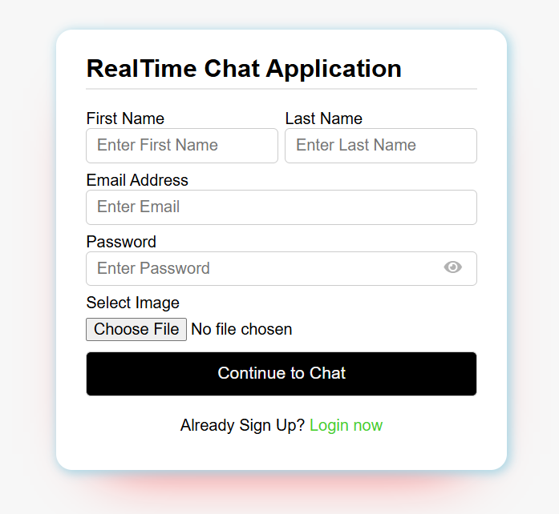

# Real Time Chat App

A real-time messaging web application built using **HTML**, **CSS**, **JavaScript**, **AJAX**, and **PHP**. This app provides a fully interactive chat experience, replicating almost all core features of a messenger.

## Features

- **Real-time Messaging**: Instant sending and receiving of messages using AJAX and PHP.
- **User Authentication**: User registration and login system for personalized chats.
- **Private Messaging**: Users can send direct messages to others live.
- **Message History**: All chat history is saved and accessible.
- **Responsive Design**: Works seamlessly across devices with mobile-friendly layout.

## Technologies Used

- **Frontend**: HTML, CSS, JavaScript, AJAX
- **Backend**: PHP
- **Database**: MySQL

## Screenshots

**The main chat interface where users can send and receive messages in real-time.**

**The register screen where users can sign up or go to login page.**
